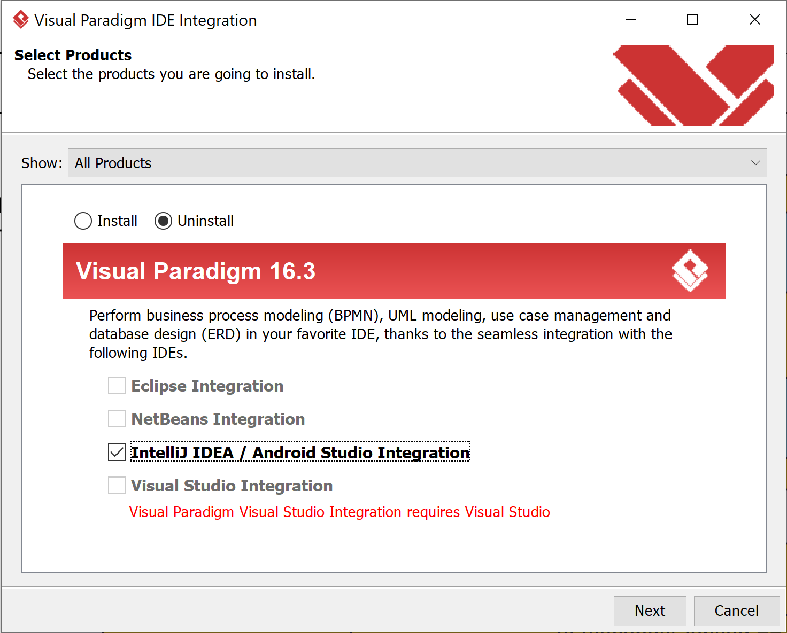
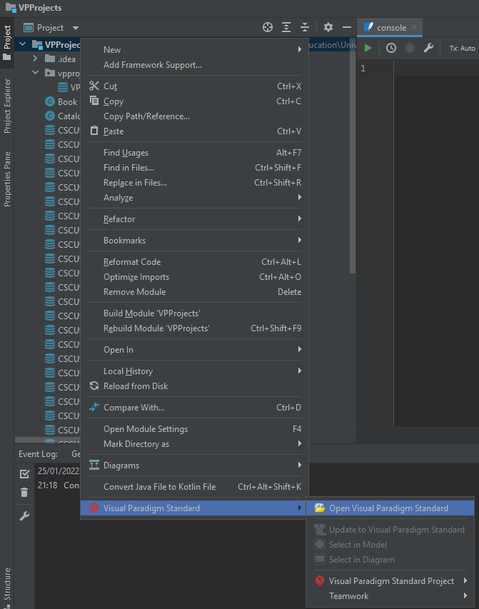
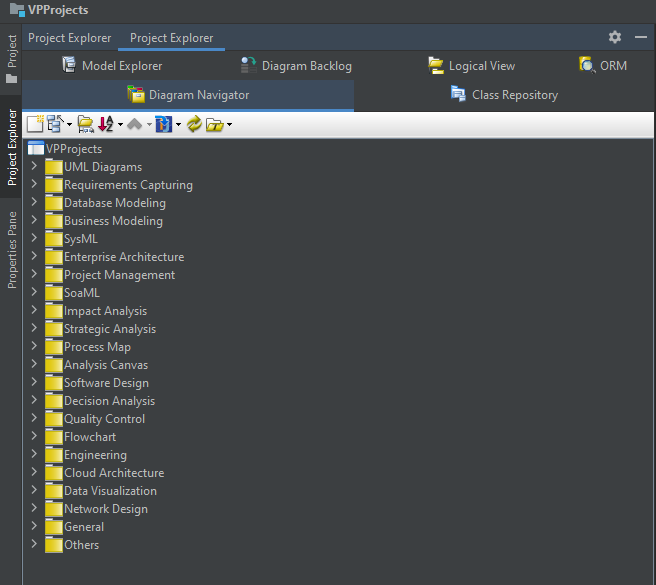

# Issues with the Visual Paradigm Plugin
Some issues can occur with the Visual Paradigm plugin for IntelliJ.

**If you currently have the plugin installed:**
1) Uninstall the Visual Paradigm Plugin.
>a) In the Visual Paradigm Application (not the plugin), select **Window > Integration > IDE Integration** from the toolbar.
> 
>b) Navigate to the screen attached, and ensure that the **Uninstall** radio button and the **IntelliJ IDEA** checkbox are selected. 
> 
>c) Click next, and the plugin should be uninstalled.

2) Update IntelliJ to the latest build version.
>a) In the IntelliJ IDEA Application, open **Settings/Preferences > Appearance & Behaviour > System Settings > Updates.**
> 
>b) Click the **Check for Updates...** button, the latest build should appear <u>_(Current version: IntelliJ IDEA 2021.3.1 IU-213.6461.79 December 28, 2021)_</u> [See What's New!](https://www.jetbrains.com/idea/whatsnew/?utm_source=product&utm_medium=link&utm_campaign=IU&utm_content=2021.3).
> 
>c) After the updates have installed, restart your IDE.
> 
>d) Ensure the updates have completed successfully, if so, complete the following steps below.
3) Reinstall the Visual Paradigm Plugin.
>a) In the Visual Paradigm Application (not the plugin), select **Window > Integration > IDE Integration** from the toolbar.
> 
>b) Navigate to the screen attached, and ensure that the **IntelliJ IDEA** checkbox is selected to install.
> 
>c) Click next, the latest build should be downloaded <u>_Visual Paradigm 16.3 Build 20220101_</u>.
4) Open up a project in IntelliJ.
5) Right click on that project and navigate to **Visual Paradigm > Open Visual Paradigm**

6) Wait for the project directory to be populated, in my case it was called vpprojects, it will contain a **.vpp** file.
7) Once Visual Paradigm has opened, you should see the new tabs available.

